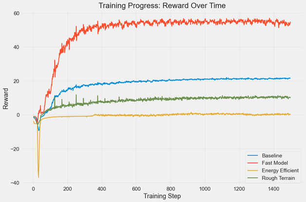
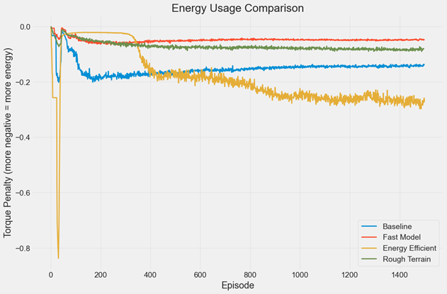
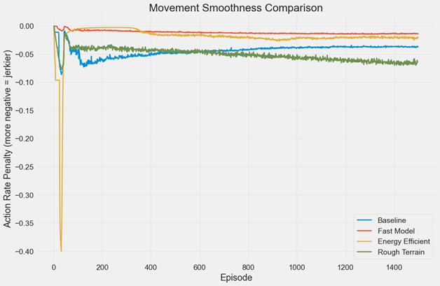

# Exploring Isaac Lab and RL Training

## Objective

The objective of this project was to familiarize myself with Nvidia's
Isaac Lab/Sim software and how it works to train quadruped robots via
Reinforcement Learning.

----

## Methods

I began by going through the intensive installation process with
Windows. Initially my plan was to utilize Microsoft's WSL to run
IsaacLab in a Linux virtual environment, but I ran into issues getting
this to install and run correctly so fell back on using Powershell and
Windows 10.

There were several tweaks to the Python batch files and commands that
needed to be made, as I had IsaacSim installed on a different hard drive
than Isaac Lab but was able to get the software up and running.

After some research and test runs on basic task
"Isaac-Velocity-Flat-Anymal-C-v0" via rl_games train.py script, I
simultaneously ran TensorBoard to see what kind of metrics IsaacLab was
providing via web-based interface. This provided great insight into how
Reinforcement Learning actually works.

From here I tested 4 different models: the aforementioned
"Isaac-Velocity-Flat-Anymal-C-v0", "Isaac-Velocity-Speed-Anymal-C-v0",
"Isaac-Velocity-Efficient-Anymal-C-v0", and
"Isaac-Velocity-Rough-Anymal-C-v0".

----

## Model Information

**"Isaac-Velocity-Flat-Anymal-C-v0"** -- This will serve as my baseline
model for comparison; it is the default reward scheme and on a flat
surface.

**"Isaac-Velocity-Speed-Anymal-C-v0"** -- This is a model that I modified
parameters to give a greater velocity reward (x3), and much less of a
penalty to torque and action rates.

**"Isaac-Velocity-Efficient-Anymal-C-v0"** -- This model I reduced the
reward for velocity by 20% and gives steep penalties for energy usage
(4x torque, 5x action rate), while also rewarding smoothness more.

**"Isaac-Velocity-Rough-Anymal-C-v0"** -- Another default model like the
Flat_Anymal, but instead of a flat terrain this has a collection of
rough terrains (think rocks, stairs). Rewards appear to be the same as
Flat-Anymal.

Each model was trained to 1500 epochs, and the data I will use for
comparison is; reward, torque, smoothness, and velocity error.

----

## Findings

----

## Final Performance Comparison

Configuration Final Reward Avg Torque Avg Smoothness Final Velocity
Error

Baseline 21.542494 -0.151464 -0.044382 0.226063

Fast Model 54.612045 -0.049154 -0.011936 0.234953

Energy Efficient 0.159568 -0.188491 -0.020813 1.313339

Rough Terrain 10.427635 -0.071819 -0.051374 0.593919

----

## Discussion

What stands out right away is the "Energy Efficient" model. In my
experience of being an HVAC Controls Technician I deal with PID control
loops (and tuning them) on a daily basis, visually his has the hallmarks
of a improperly tuned loops. The initial massive swings in penalty
values would be equivalent to an improper P gain, while the noisy torque
penalty is indicative of a bad I gain value hence the poor dampening and
leveling of the data. This taught me that the reward values for the
"Energy Efficient" model are in need of some adjusting to make for a
more effective model. The massive Final Velocity error (1.3) is also a
sign something is not quite right. Also note that I believe this poor
reward valuations (.16) is why the "Energy Efficient" model was actually
the least efficient of all the models.

Another thing that stood out to me was the low Final Reward value of the
"Rough Terrain" model (10.42). I found it odd that it was half of that
of the baseline and double the error. What I believe to be the case is
that really the model is running a much more difficult task and that the
1500 epochs I limited these to would need to be raised for proper
training. If I ran this at perhaps 5000 epochs, I believe I will see a
much lower velocity error and an increase in final reward.

Finally the "Fast" model showed a significantly faster rate of reward
than any other model. This makes sense given the much high level of
rewards and reduction of penalty in it's training. One thing I did find
surprising was that the "Fast" model has the smoothest movement of any
of the models, I anticipated that the "Baseline" would have or even the
"Energy Efficient" model as it would have ran at a slower rate. After
doing some research I found that this actually makes sense as to why the
higher energy "Fast" model is the smoother model. Without the same
energy constraints as these other models it allows for the "Fast" model
to make longer movements, which led to a smoother gait, whereas the more
energy restricted models were limited in the movements that they could
make leading to a jerkier movement. Think of it like running versus
shuffling your feet, running is a much more fluid motion than shuffling
around inch by inch. It was quite interesting to come to this
realization, as it seemed counter intuitive to me at first but when I
took the time to find out why, it make perfect sense. It is also quite
curious that the "Fast" model was the most efficient of all the models,
which I think may be due to greater stability per the smoothness. This
result highlights that energy constraints can sometimes reduce
performance quality, not just speed.

Future items I'd like to explore is running these simulations for much
longer, 5000 epochs as mentioned before, and seeing if this still trends
the same direction. I also want to tune the reward values of the "Energy
Efficient" model to try and achieve what it's intended purpose is. I
believe trying the "Fast" model with the Rough terrain would be an
interesting experiment as well. Finally, I would like to try the other
teaching types of robots other than just quadrupeds for comparison.

----

## Summary

To conclude my first experience using IsaacLab was incredibly insightful
and gave me a lot of exposure to what is involved in training robots via
Reinforcement Learning. My goal is to keep learning more about this
software and all the different capabilities, as well as learn more
technically with the Python scripting so I am more comfortable with
editing/building my own models to use. I will update this GitHub project
in the future when I tackle these items. This project gave me hands-on
experience with the complete ML robotics pipeline: environment setup,
reward engineering, training at scale, data analysis, and iterative
improvement - skills directly applicable to real-world robotics
development.
